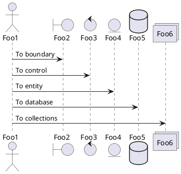

## データの型定義
## フロントエンドについて
## バックエンドについて
### 認証周りについてのフローについて

```plantuml example2
@startuml
actor Foo1
boundary Foo2
control Foo3
entity Foo4
database Foo5
collections Foo6
Foo1 -> Foo2 : To boundary
Foo1 -> Foo3 : To control
Foo1 -> Foo4 : To entity
Foo1 -> Foo5 : To database
Foo1 -> Foo6 : To collections

@enduml
```